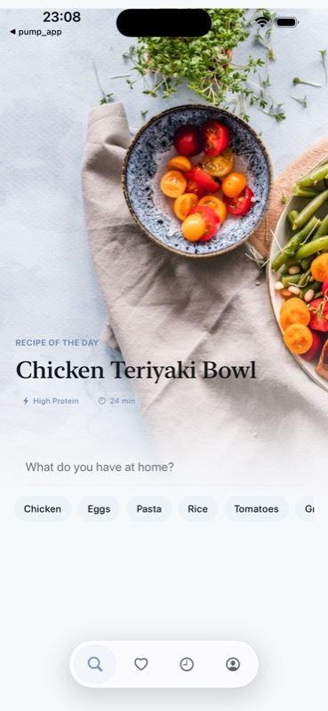

# Pump Kitchen

[](https://github.com/Win4ez-ru/Pump-Kitchen/actions/workflows/ios-ci.yml)

SwiftUI recipe companion that turns the ingredients a user already has into fitness-aware meals. The app supports a production backend, a built-in mock mode, authentication, saved recipes, localization, and a home-screen widget.

## Preview



## Highlights

- Search and generate recipes from free-form ingredient input.
- Personalize results by fitness goal, activity level, and dietary preferences.
- Register, sign in, and persist an auth token securely in Keychain.
- View recipe details, nutrition, cooking steps, substitutions, and scaled amounts.
- Save favorites locally in mock mode or synchronize them with the backend.
- Keep search history with SwiftData.
- Use the app in English or Russian through a String Catalog.
- Surface a featured recipe with a WidgetKit extension.

## Stack

- Swift 6 and SwiftUI
- MVVM with protocol-based dependency injection
- Swift Concurrency and URLSession
- SwiftData and UserDefaults
- Keychain-backed authentication
- WidgetKit
- XCTest and XCUITest
- iOS 18+ / Xcode 26

## Architecture

```text
PumpKitchen/
├── App/                 App entry point and navigation
├── Core/
│   ├── Auth/            Session, token storage, backend auth
│   ├── DesignSystem/    Colors, typography, spacing, motion
│   ├── Errors/          User-facing error mapping
│   ├── Models/          Domain models
│   ├── Networking/      Endpoint and API abstractions
│   ├── Storage/         SwiftData repositories and settings
│   └── Utilities/       Parsing, translation, links, snapshots
└── Features/
    ├── Auth/
    ├── Favorites/
    ├── History/
    ├── Home/
    ├── Onboarding/
    ├── RecipeDetails/
    └── Settings/

PumpKitchenWidget/       WidgetKit extension
PumpKitchenTests/        Unit and repository tests
PumpKitchenUITests/      Smoke and screenshot UI tests
```

`AppContainer` is the composition root. Views own presentation, view models own screen state and user actions, and protocols isolate networking and persistence implementations.

## Run locally

1. Open `Pump Kitchen.xcodeproj` in Xcode 26 or newer.
2. Select the `Pump Kitchen` scheme and an iOS 18+ simulator.
3. Build and run.
4. Open Profile and enable **Use Mock Backend** to explore the full recipe flow without external services.

To use a real backend, configure its base URL in Profile. AI provider keys stay on the server and are never stored in the iOS app. The expected API is documented in [`BACKEND_CONTRACT.md`](BACKEND_CONTRACT.md).

## Tests

Run the local unit and UI suite:

```bash
xcodebuild test \
  -project "Pump Kitchen.xcodeproj" \
  -scheme "Pump Kitchen" \
  -destination 'platform=iOS Simulator,name=iPhone 17,OS=latest' \
  CODE_SIGNING_ALLOWED=NO
```

The repository currently contains 28 automated tests covering DTO mapping, ingredient parsing and translation, recipe scaling, deep links, repositories, and core UI flows. See [`MVP_TEST_PLAN.md`](MVP_TEST_PLAN.md) for the backend smoke test and manual release checklist.

## Security

- Backend and AI-provider credentials are server-side only.
- Auth tokens are stored in Keychain.
- The app never commits environment secrets.
- Public backend deployments should enable HTTPS, validation, rate limiting, and authenticated endpoints.

## Status

The repository is an actively developed portfolio MVP. The iOS client, mock experience, automated tests, and backend contract are complete; production deployment and App Store release assets remain separate release tasks.
